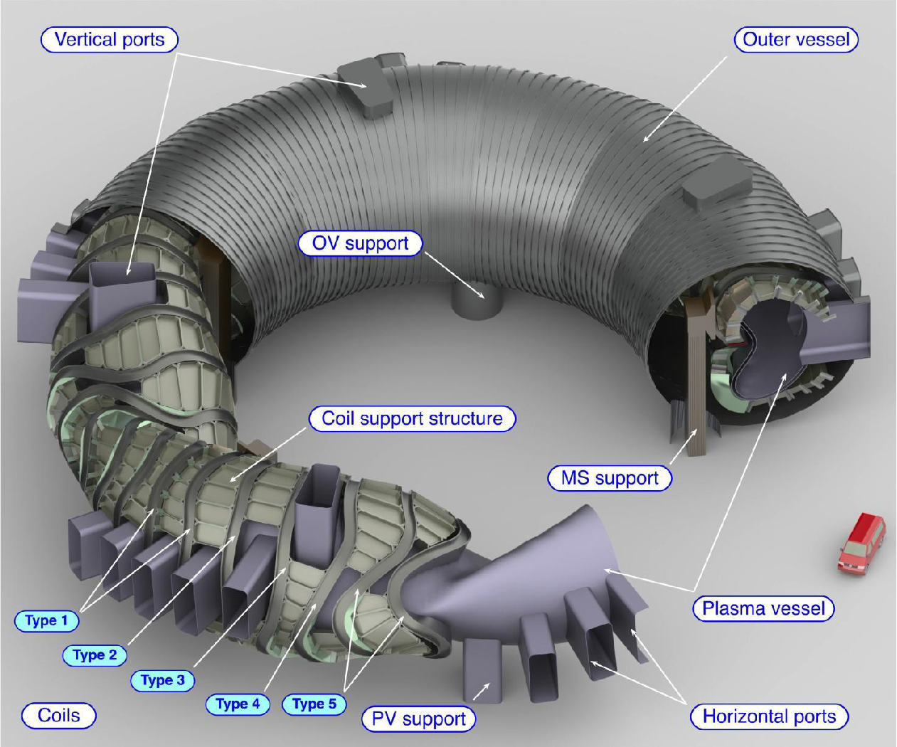
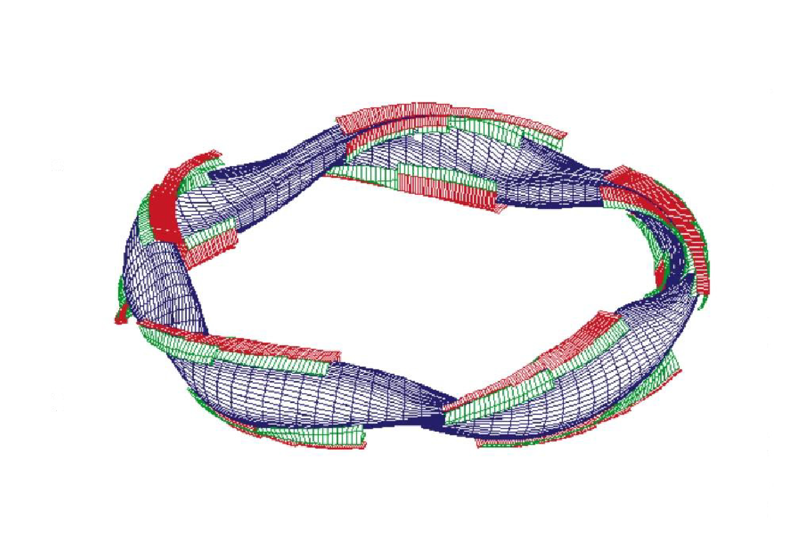

# Stellarator Model

The code has the ability to perform calculations based on the physics and engineering of a stellarator, which, although being a toroidal device, is radically different in a number of ways from a tokamak.

The model is largely based on W7-X and the HELIAS 5-B stellarator power plant design[^1] (Figure 1) and related modelling that has been performed by IPP Greifswald[^2] [^3] [^4]

*Figure 1: Fusion power core of the HELIAS 5-B conceptual power plant design*[^1]

To activate the stellarator coding, it is necessary to create a file `deivce.dat`, containing the single character 1 in the first row, in the working directory. This has the effect of setting the internally-used switch `istell = 1`. If the file is absent, or its first character is set to something other than 1, the stellarator model is not used, and `istell` is set to 0.

The stellarator model is largely contained within source file `stellarator.f90`. The following consistency equations should be used without modifications:

1 : plasma beta consistency

2 : global power balance

11 : radial build consistency

## Stellarator physics

Much of the physics is identical to that for tokamaks, including the plasma composition and the fusion power calculations. However, some physics topis do differ between stellarators and tokamaks, as follows.

### Plasma geometry

The plasma geometry model uses Fourier coefficients to represent the complex 3-D plasma shape typical of stellarators. A VMEC[^5] calculation (or other equilibrium code that can provide the Fourier coefficients of the LCFS) must have been performed prior to running with `PROCESS`. The overall size of the plasma is scaled correctly for the required (mean) major and minor radii for the machine being modelled[^6].

It is necessary to provide three input files that define the plasma shape:

1. Set `vmec_info_file` in the input file to the name of a file with the following format (the numbers given are those for the W7-X high mirror configuration); in practice only the effective major and minor radius values (`R_eff` and `a_eff` respectively) and the number of field periods are used:

    | R_eff [m] | a_eff [m] | Aspect ratio | Plasma vol [m$^3$] | LCFS surf area [m$^2$] | field periods |
    | --- | --- | --- | --- | --- | --- |
    | 5.486576 | 0.4942638 | 11.10050 | 26.45749 | 133.4281 | 5.0 |

2. Set `vmec_rmn_file` in the input file to the name of a VMEC output file containing the calculated plasma boundary $R(m,n)$ Fourier coefficients, where $m$ = 0 to 11 (rows) and $n$ = -12 to 12 (columns).

3. Set `vmec_zmn_file` in the input file to the name of a VMEC output file containing the calculated plasma boundary $Z(m,n)$ Fourier coefficients, where $m$ = 0 to 11 (rows) and $n$ = -12 to 12 (columns).

This method enables a wide range of potential plasma geometries to be modelled, of required. The plasma volume, surface area and mean cross-sectional area are the outputs from the geometry model.

### Absence of plasma current

Stellarators try to achieve zero plasma current in order to allow safe divertor operation, so no current scalings are required.

### Beta limit

The beta limit is assumed to be 5%, based on 3-D MHD calculations[^7]. To apply the beta limit, constraint equation no. 24 should be turned on with iteration variable no. 36 (`fbetatry`).

### Density limit

The density limit relevant to stellarators has been proposed to be[^8]

$n_{max} = 0.25(PB_0/R_0a^2_p)^{1/2}$

where $n$ is the line-averaged electron density in units of $10^{20} m^{-3}$, $p$ is the absorbed heating power (MW), $B_0$ is the on-axis field (t), $R_0$ is the major radius (m), and $a_p$ is the plasma minor radius (m). To enforce the density limit, turn on constraint equation no. 5 with iteration variable no. 9 (`fdene`).

### $\tau_E$ scaling laws

Five confinement time scaling laws relevant to stellarators are present within `PROCESS`. The value of switch isc` determines which of these in the plasma energy balance calculation.

$\tau_E$ (Large Helical Device[^8]: `isc=21`) = $0.17 \, R^{0.75}_0 \, a^2_p \, \bar{n}^{0.69}_{20} \, B^{0.84}_0 \, P^{-0.58}$  
$\tau_E$ (Gyro-reduced Bohm[^9]: `isc=22`) = $0.25 \, R^{0.6}_0 \, a^{2.4}_p \, \bar{n}^{0.6}_{20} \, B^{0.8}_0 \, P^{-0.6}$  
$\tau_E$ (Lackner-Gottardi[^10]: `isc=23`) = $0.17 \, R_0 \, a^2_p \, \bar{n}^{0.6}_{20} \, B^{0.8}_0 \, P^{-0.6} \, \iota^{0.4}$  
$\tau_E$ (ISS95[^11]: `isc=37`) = $0.079 \, R^{0.65}_0 \, a^{2.21}_p \, \bar{n}^{0.51}_{20} \, B^{0.83}_0 \, P^{-0.59} \, \bar{\iota}^{0.4}$  
$\tau_E$ (ISS04[^12]: `isc=38`) = $0.134 \, R^{0.64}_0 \, a^{2.28}_p \, \bar{n}^{0.54}_{20} \, B^{0.84}_0 \, P^{-0.61} \, \bar{\iota}^{0.41}$

Here $\bar{\iota}$ is the rotational transform, which is equivalent to the reciprocal of the tokamak safety factor $q$.

### Heating power options

Stellarators require no curren drive, although provision for auxiliary heating does need to be present. The method by which auxiliary heating power is supplied is determined by the switch `isthtr`:

`isthtr = 1` : electron cyclotron resonance heating

`isthtr = 2` : lower hybrid heating

`isthtr = 3` : neutral beam injection

The value of variable `pheat` determines the actual amount of auxiliary heating power (in Watts) to be applied to the plasma. This variable may be used as an iteration variable (no. 11). Switch `ignite` may be used if necessary.

### Divertor

Although the divertor has the same function in both stellarators and tokamaks, the envisaged concepts differ quite substantially. This is not only related to the different geometry and symmetries but also specifically to the magnet configuration. While the inherent axisymmetry of a tokamak allows for poloidally-continuous single of double divertor configurations, the periodicity of helical advanced stellarators leads to multiple X-points with a corresponding chain of magnetic islands. This island structure may be exploited by carefully placing divertor plates along the stochastic field lines, naturally leading to a discontinuous divertor, with the individual plates being placed in a complex 3-D geometry; see Figure 2.

Figure 2: *A five-period HELIAS plasma (specifically W7-X) with island divertor plates shown in red*

Rather than trying to describe the complex physics with a two-point scrape-off layer model as is used for tokamaks, the stellarator divertor model[^3] is based on fundamental principles which relate the power crossing the separatrix with an effective wetted area on the divertor plates allowing the code to estimate the heat load delivered to the divertor. A basic island divertor model is used which assumes diffusive cross-field transport and high radiation at the X-point.

The radiated power fraction in the scrape-off layer is given by the input parameter `f_rad`. This is in contrast to the method used for tokamaks, in which the radiated power fraction is a calculated quantity.

A number of other input parameters may be used to modify the divertor model; see the variable descriptor file for more details.

## Machine configuration

There are a large number of possible stellarator configurations. As stated earlier, the one chosen for the `PROCESS` model is based on the <b>HELI</b>cal <b>A</b>dvanced <b>S</b>tellarator (HELIAS) concept, in which all the coils resemble distorted, non-planar TF coils - no helical coils or tokamak-like PF coils are present. The coil geometry is scaled from the HELIAS 5-B power plant design, which is based on a five field-period HELIAS configuration.

### Machine build

Since a stellarator is inherently non-axisymmetric, the build of the `PROCESS` stellarator is definedin terms of the mean thicickness of components.

The surface areas of for the first wall, blanket and shield components are scaled linearly with their effective minor radius from the plasma surface area calculation(the area of a simple torus of circular cross-section is $4\pi^2Ra$, hence the linear scaling with $a$). The input parameters `fhole` may be used to specify the hole fraction, to adjust the surface area to take into account of ports and divertors, for instance. The volume of the first wall etc. are simply given by the product of their surface area and their mean thickness.

In contrast to tokamaks, which in `PROCESS` are assumed to have a cylindrical external cryostat completely surrounding the fusion power core, the stellarator model assumes that the external cryostat (labelled as the outer vessel in Figure 1) is toroidal with a circular cross-section. Its cross-section is assumed to be centred at the mean plasma major radius.

All items external to the fusion power core (buildings, turbines, power conversion systems, etc.) remain unchanged.

### Stellarator coils

The stellarator coil model[^4] [^13] combines scaling aspects based on the HELIAS 5-B design in combination with analytic inductance and field calculations.

The fully three-dimensional shape of the coils is assumed to be fixed, but the sizes of the coils are scaled from the HELIAS 5-B values to the geometrical values for the machine being modelled using fundamental physics and engineering principles.

The stellarator coils are assumed to be superconducting - no resistive coil calculations are performed. The critical field at the superconductor is calculated using circular approximations for the coils in the inductance and field calculations, and the limit is enforced automatically. Available superconductors are Nb3Sn (`isumattf = 1`) and NbTi (`isumattf = 3`).

The winding pack cross-section is rectangular for the stellarator coils, rather than the complicated two-step cross-section assumed for tokamaks. The coil thicknesses and most of the dimensions of the materials within the coil cross-section are outputs from the model, instead of being inputs as is the case for tokamaks; see the variable descriptor file for details. In addition, certain iteration variables (`tfcth`, no. 13; `thkcas`, no. 57; `cpttf`, no. 60 and `tftort`, no. 77) should not be turned on in the input file as they are calculated self-consistently; the code will stop with an error message of this is attempted.

[^1]: F. Schauer, K. Egorov and V. Bykov, *"HELIAS 5-B magnet system structure and maintenance concept"*, Fusion Engineering and Design 88 (2013) 1619-1622
[^2]: F. Warmer, *"Stellarator Plasma Geometry model for the systems code PROCESS"*, IPP Greifswald, Germany, internal note, 19/06/2013
[^3]: F. Warmer, *"Stellarator Divertor model for the systems code PROCESS"*, IPP Greifswald, Germany, internal note, 21/06/2013
[^4]: F. Warmer and F. Schauer, *"Stellarator Coil model for the systems code PROCESS"*, IPP Greifswald, Germany, internal note, 07/10/2013
[^5]: VMEC MHD force balance code for toroidal domains, http://vmecwiki.pppl.wikispaces.net/VMEC
[^6]: J. Geiger, *"Darstellung von ineinandergeschachtelten toroidal  eschlossenen Flachen mit Fourierkoeffizienten"* *"Representation of nested, closed surfaces with Fourier coefficients"* IPP Greifswald, Germany, internal document, 06/07/2010
[^7]: J. Nuhrenberg et al., *PLasma Physics and Controlled Fusion*, **35** (1993) B115
[^8]: S. Sudo, Y. Takeiri, H. Zushi et al., *Nuclear Fusion*, **30** (1990) 11
[^9]: R. J. Goldston, H. Biglari, G. W. Hammett et al., *Bull. Am. Phys. Society*, **34** (1989) 1964 
[^10]: K. Lackner and N. A. O. Gottardi, *Nuclear Fusion*, **30** (1990) 767
[^11]: U. Stroth et al., *Nuclear Fusion*, **36** (1996) 1063
[^12]: H. Yamada et al., *Nuclear Fusion*, **45** (2005) 1684
[^13]: F. Warmer, *"Stellarator Modular Coil model for the systems code PROCESS"*, IPP Greifswald, Germany, internal note, 31/07/2013